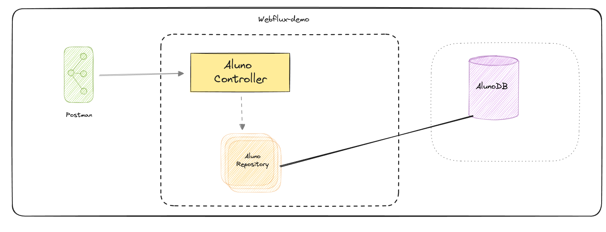

# demo-webflux

Programação reativa com WebFlux e Spring-Boot.

Youtbe video: https://youtu.be/q79JzoXHVBU

## Required

- Java 21
- Maven
- Spring-Boot

## Dependencies

- webflux
- r2dbc
- postgresql
- lombok

## Aprenda um pouco sobre Programação Reativa  

A programação reativa tem se tornado cada vez mais popular devido a várias vantagens que oferece no desenvolvimento de
software. Aqui estão algumas razões pelas quais você deve considerar o uso de programação reativa:

1. **Responsividade**: A programação reativa permite a criação de sistemas altamente responsivos, capazes de reagir a
   eventos de forma eficiente e em tempo real. Isso é particularmente útil em aplicações que exigem atualizações
   contínuas, como interfaces de usuário interativas, jogos e sistemas de monitoramento.

2. **Escalabilidade**: Sistemas reativos são mais fáceis de escalar horizontalmente, o que significa que você pode
   adicionar mais recursos ao sistema (como mais servidores) para lidar com uma maior carga de trabalho. Isso é crucial
   para aplicações que precisam suportar um grande número de usuários simultâneos.

3. **Facilidade de Gerenciamento de Estados**: A programação reativa facilita o gerenciamento de estados em aplicações
   complexas. Com fluxos de dados assíncronos, você pode tratar mudanças de estado de maneira declarativa, tornando o
   código mais intuitivo e menos propenso a erros.

4. **Tratamento Eficiente de Eventos Assíncronos**: Em ambientes onde há muitos eventos assíncronos (como cliques de
   usuários, mensagens de rede, etc.), a programação reativa oferece uma maneira natural e eficiente de lidar com esses
   eventos. Isso é feito através de construções como observáveis e fluxos de dados que propagam mudanças
   automaticamente.

5. **Código Mais Limpo e Manutenível**: Ao usar programação reativa, o código tende a ser mais conciso e expressivo, o
   que melhora a legibilidade e a manutenção. Em vez de lidar com callbacks e estados mutáveis de maneira imperativa,
   você define como os dados fluem através do sistema, o que pode reduzir significativamente a complexidade do código.

6. **Integração com Tecnologias Modernas**: Muitas das tecnologias modernas e frameworks, como Angular, ReactJS e
   bibliotecas como RxJS, são projetadas com paradigmas reativos em mente. Isso facilita a integração e o uso dessas
   tecnologias no desenvolvimento de aplicações modernas.

7. **Melhor Manuseio de Erros**: A programação reativa oferece mecanismos robustos para tratar erros e exceções de forma
   elegante e eficiente, permitindo que você defina estratégias de recuperação e ações corretivas sem espalhar lógica de
   tratamento de erros por todo o código.

| **Característica**           | **Programação Reativa**                                                | **RestAPIs**                                    |
|------------------------------|------------------------------------------------------------------------|-------------------------------------------------|
| **Fluxo de Dados**           | Contínuo e assíncrono                                                  | Requisição-resposta (síncrono)                  |
| **Comunicação**              | Bidirecional                                                           | Unidirecional                                   |
| **Tratamento de Erros**      | Centralizado e propagado ao longo do fluxo de dados                   | Individual por requisição                       |
| **Escalabilidade**           | Alta, com fácil distribuição de carga                                  | Depende da infraestrutura, pode ser limitada    |
| **Complexidade**             | Maior complexidade inicial, mais eficiente em longo prazo              | Menor complexidade inicial, potencialmente menos eficiente em longo prazo |

Por essas razões, a programação reativa é uma escolha poderosa para desenvolver sistemas modernos, escaláveis e
responsivos. Ela não só melhora a eficiência do desenvolvimento como também a qualidade do produto final.
